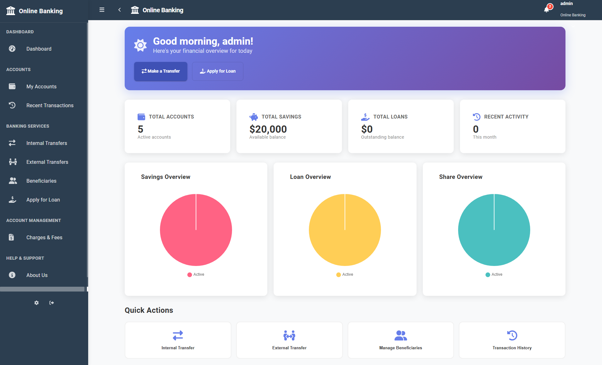

# Online Banking App



A modern, feature-rich online banking application built with Angular 15. This application provides a comprehensive banking experience with account management, transfers, loans, and more.

## 📋 Table of Contents

- [Features](#-features)
- [Technology Stack](#️-technology-stack)
- [Prerequisites](#-prerequisites)
- [Getting Started](#-getting-started)
- [Project Structure](#-project-structure)
- [Build Commands](#️-build-commands)
- [Testing](#-testing)
- [Development](#-development)
- [Features Overview](#-features-overview)
- [Contributing](#-contributing)
- [License](#-license)
- [Team](#-team)
- [Support](#-support)

## 🚀 Features

- **Account Management**: View and manage savings, loan, and share accounts
- **Fund Transfers**: Transfer money between accounts with review functionality
- **Third Party Transfers (TPT)**: Send money to external beneficiaries
- **Loan Applications**: Apply for loans with validation
- **Transaction History**: View recent transactions across all accounts
- **Beneficiary Management**: Add and manage transfer beneficiaries
- **Charges Overview**: Monitor account charges and fees
- **Responsive Design**: Mobile-friendly interface with Material Design
- **Authentication**: Secure login with session management
- **Multi-language Support**: Internationalization ready
- **Dashboard Analytics**: Interactive charts and data visualization
- **Profile Management**: User profile and settings management
- **Password Management**: Secure password change functionality

## 🛠️ Technology Stack

- **Frontend**: Angular 15.2.9
- **UI Framework**: Angular Material 15.2.9
- **Styling**: SCSS with Flex Layout
- **Charts**: Chart.js and CanvasJS
- **Icons**: FontAwesome
- **State Management**: RxJS
- **Build Tool**: Angular CLI 15.2.9
- **Package Manager**: npm
- **Mock Server**: Custom Node.js server for development

## 📋 Prerequisites

Before running this application, make sure you have the following installed:

- [Node.js](https://nodejs.org/) (v14 or higher)
- [npm](https://www.npmjs.com/) (comes with Node.js)
- [Git](https://git-scm.com/)

## 🚀 Getting Started

### 1. Install Angular CLI

```bash
npm install -g @angular/cli@15.2.9
```

### 2. Clone the Repository

```bash
git clone https://github.com/Tuhin-SnapD/Online-Banking-App.git
cd Online-Banking-App
```

### 3. Install Dependencies

```bash
npm install
```

### 4. Start Development Server

```bash
ng serve
# or
npm start
```

Navigate to `http://localhost:4200/` to view the application.

### 5. Start Mock Server (Optional)

For a complete development experience, you can also start the mock server:

```bash
node mock-server.js
```

### 6. Default Login Credentials

The application uses a development server with basic authentication:

- **Username**: `admin`
- **Password**: `password`

> **Important**: These are development credentials. Do not use in production.

## 📁 Project Structure

```
src/
├── app/
│   ├── accounts/          # Account management modules
│   │   ├── account-statements/     # Account statements
│   │   ├── loan-account-details/   # Loan account details
│   │   ├── loan-accounts-list/     # Loan accounts listing
│   │   ├── savings-account-details/ # Savings account details
│   │   ├── savings-accounts-list/  # Savings accounts listing
│   │   ├── share-accounts-list/    # Share accounts listing
│   │   └── standing-instructions/  # Standing instructions
│   ├── beneficiaries/     # Beneficiary management
│   ├── charges/          # Charges and fees
│   ├── core/             # Core services and guards
│   │   ├── authentication/ # Authentication services
│   │   ├── http/         # HTTP interceptors
│   │   ├── shell/        # Main shell component
│   │   └── i18n/         # Internationalization
│   ├── home/             # Dashboard and overview
│   │   ├── loan-overview-pie/    # Loan charts
│   │   ├── savings-overview-pie/ # Savings charts
│   │   └── share-overview-pie/   # Share charts
│   ├── loans/            # Loan application
│   ├── login/            # Authentication
│   ├── transfers/        # Fund transfers
│   ├── third-party-transfer/ # Third party transfers
│   ├── recent-transactions/ # Transaction history
│   ├── profile/          # User profile
│   ├── settings/         # Application settings
│   ├── change-password/  # Password management
│   ├── about-us/         # About page
│   └── shared/           # Shared components and modules
├── assets/               # Static assets
│   ├── icons/           # PWA icons
│   └── images/          # Application images
├── environments/         # Environment configurations
└── translations/         # Internationalization files
```

## 🏗️ Build Commands

### Development Build
```bash
ng build
```

### Production Build
```bash
ng build --configuration production
```

### GitHub Pages Deployment
```bash
npm run deploy
```

### Generate PWA
```bash
ng add @angular/pwa
```

## 🧪 Testing

### Unit Tests
```bash
ng test
```

### End-to-End Tests
```bash
ng e2e
```

### Linting
```bash
ng lint
```

### Code Coverage
```bash
ng test --code-coverage
```

## 🔧 Development

### Generate New Components
```bash
ng generate component component-name
```

### Generate Services
```bash
ng generate service service-name
```

### Generate Modules
```bash
ng generate module module-name
```

### Generate Guards
```bash
ng generate guard guard-name
```

### Generate Interceptors
```bash
ng generate interceptor interceptor-name
```

## 📱 Features Overview

### 🏠 Dashboard
- Account balance overview with interactive charts
- Recent transactions with filtering
- Quick action buttons for common tasks
- Real-time balance updates
- Pie charts for account distribution

### 💳 Account Management
- **Savings Accounts**: View balances, transactions, and statements
- **Loan Accounts**: Track loan status, payments, and schedules
- **Share Accounts**: Monitor share holdings and dividends
- **Account Statements**: Download and view detailed statements
- **Standing Instructions**: Manage recurring transfers

### 💸 Transfers
- **Internal Transfers**: Move money between your accounts
- **Third-party Transfers**: Send money to external beneficiaries
- **Beneficiary Management**: Add and manage transfer recipients
- **Transfer History**: Complete transaction log
- **Review System**: Confirm transfers before execution

### 🏦 Loans
- **Loan Application**: Comprehensive application form
- **Loan Status Tracking**: Monitor application progress
- **Payment Schedules**: View upcoming payments
- **Loan History**: Track all loan activities

### 👥 User Management
- **Profile Management**: Update personal information
- **Password Security**: Secure password change
- **Settings**: Customize application preferences
- **Session Management**: Secure login/logout

### 📊 Analytics & Reports
- **Transaction Analytics**: Spending patterns and insights
- **Account Performance**: Track account growth
- **Charges Overview**: Monitor fees and charges
- **Export Capabilities**: Download reports and statements

## 🤝 Contributing

We welcome contributions! Please follow these steps:

1. **Fork** the repository
2. **Create** a feature branch (`git checkout -b feature/amazing-feature`)
3. **Commit** your changes (`git commit -m 'Add some amazing feature'`)
4. **Push** to the branch (`git push origin feature/amazing-feature`)
5. **Open** a Pull Request

### Development Guidelines

- Follow Angular style guide
- Write unit tests for new features
- Update documentation as needed
- Ensure responsive design
- Test across different browsers

## 📄 License

This project is licensed under the MIT License - see the [LICENSE](LICENSE) file for details.

## 👥 Team

This project was developed by a team of 4 developers inspired by existing banking models and modern fintech applications.

### Key Contributors
- **Tuhin-SnapD** - Project Lead & Full Stack Development
- **Team Members** - UI/UX Design, Backend Integration, Testing

## 🆘 Support

For support and questions:

- 📧 **Email**: Open an issue in the GitHub repository
- 🐛 **Bug Reports**: Use the GitHub issue tracker
- 💡 **Feature Requests**: Submit through GitHub issues
- 📖 **Documentation**: Check the inline code comments

## 🔒 Security

This is a demonstration application and should not be used for actual banking operations. For production use:

- Implement proper security measures
- Use HTTPS in production
- Add rate limiting
- Implement proper authentication
- Regular security audits
- Follow banking compliance standards

---

**Note**: This is a demonstration application built for educational and portfolio purposes. It showcases modern web development practices and should not be used for actual banking operations.

**Built with ❤️ using Angular 15**

